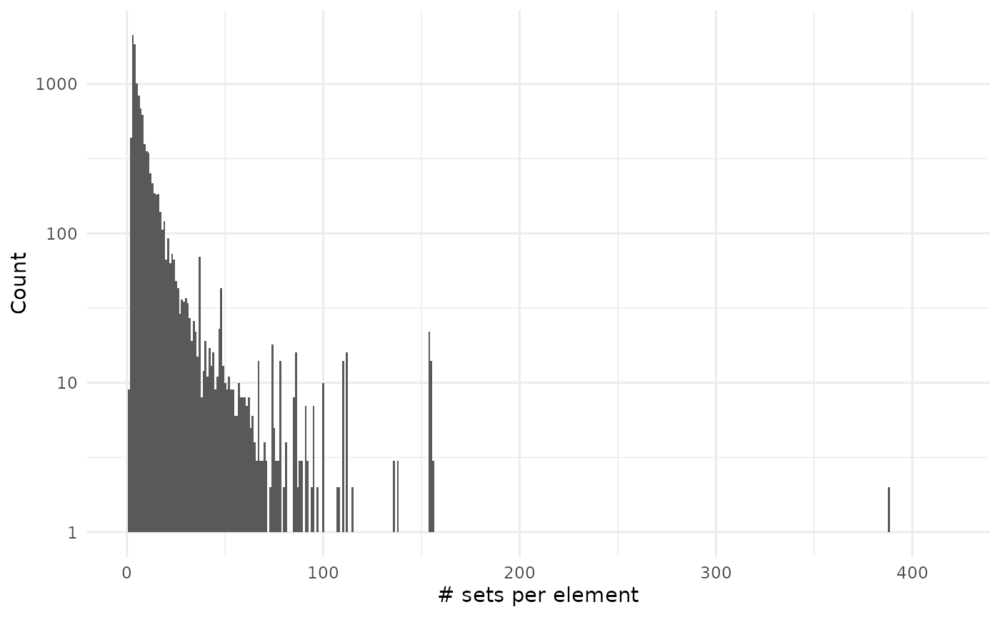
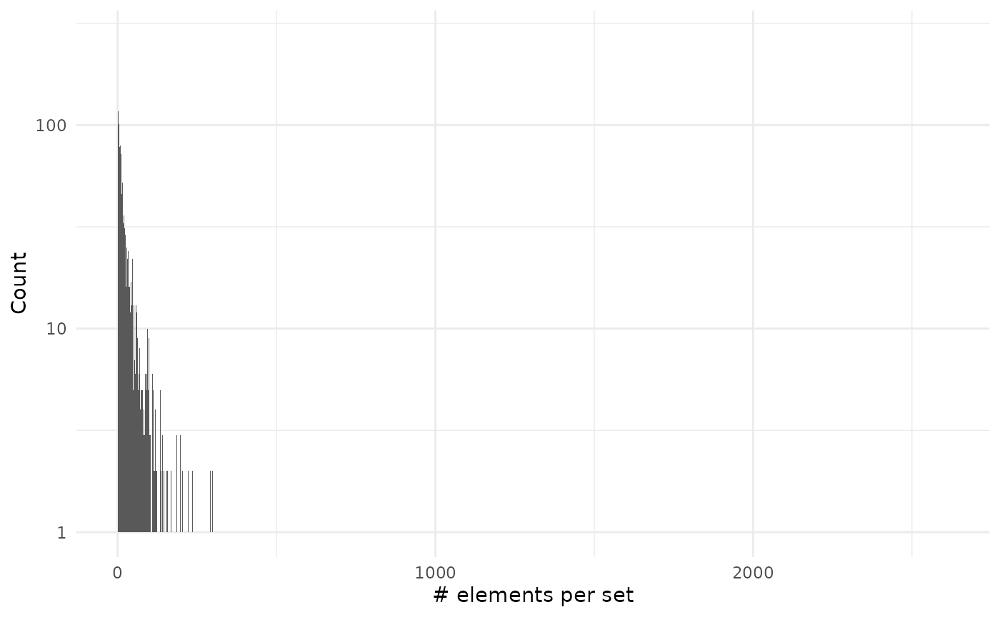

# Advanced examples

Abstract

This vignette assumes you are familiar with set operations from the
basic vignette.

## Initial setup

To show compatibility with tidy workflows we will use magrittr pipe
operator and the dplyr verbs.

``` r
library("BaseSet", quietly = TRUE)
library("dplyr", quietly = TRUE)
```

## Human gene ontology

We will explore the genes with assigned gene ontology terms. These terms
describe what is the process and role of the genes. The links are
annotated with different [evidence
codes](https://geneontology.org/docs/guide-go-evidence-codes/) to
indicate how such annotation is supported.

``` r
# We load some libraries
library("org.Hs.eg.db", quietly = TRUE)
library("GO.db", quietly = TRUE)
library("ggplot2", quietly = TRUE)
# Prepare the data 
h2GO_TS <- tidySet(org.Hs.egGO)
h2GO <- as.data.frame(org.Hs.egGO)
```

We can now explore if there are differences in evidence usage for each
ontology in gene ontology:

``` r
library("forcats", include.only = "fct_reorder2", quietly = TRUE)
h2GO %>% 
    group_by(Evidence, Ontology) %>% 
    count(name = "Freq") %>% 
    ungroup() %>% 
    mutate(Evidence = fct_reorder2(Evidence, Ontology, -Freq),
           Ontology = case_match(Ontology,
                                 "CC" ~ "Cellular Component",
                                 "MF" ~ "Molecular Function",
                                 "BP" ~ "Biological Process",
                                 .default = NA)) %>% 
    ggplot() +
    geom_col(aes(Evidence, Freq)) +
    facet_grid(~Ontology) + 
    theme_minimal() +
    coord_flip() +
    labs(x = element_blank(), y = element_blank(),
         title = "Evidence codes for each ontology")
#> Warning: `label` cannot be a <ggplot2::element_blank> object.
#> `label` cannot be a <ggplot2::element_blank> object.
```


We can see that biological process are more likely to be defined by IMP
evidence code that means inferred from mutant phenotype. While inferred
from physical interaction (IPI) is almost exclusively used to assign
molecular functions.

This graph doesn’t consider that some relationships are better annotated
than other:

``` r
h2GO_TS %>% 
    relations() %>% 
    group_by(elements, sets) %>% 
    count(sort = TRUE, name = "Annotations") %>% 
    ungroup() %>% 
    count(Annotations, sort = TRUE) %>% 
    ggplot() +
    geom_col(aes(Annotations, n)) +
    theme_minimal() +
    labs(x = "Evidence codes", y = "Annotations", 
         title = "Evidence codes for each annotation",
         subtitle = "in human") +
    scale_x_continuous(breaks = 1:7)
```


We can see that mostly all the annotations are done with a single
evidence code. So far we have explored the code that it is related to a
gene but how many genes don’t have any annotation?

``` r
# Add all the genes and GO terms
h2GO_TS <- add_elements(h2GO_TS, keys(org.Hs.eg.db)) %>% 
    add_sets(grep("^GO:", keys(GO.db), value = TRUE))

sizes_element <- element_size(h2GO_TS) %>% 
    arrange(desc(size))
sum(sizes_element$size == 0)
#> [1] 172778
sum(sizes_element$size != 0)
#> [1] 20835

sizes_set <- set_size(h2GO_TS) %>% 
    arrange(desc(size))
sum(sizes_set$size == 0)
#> [1] 21042
sum(sizes_set$size != 0)
#> [1] 18864
```

So we can see that both there are more genes without annotation and more
gene ontology terms without a (direct) gene annotated.

``` r
sizes_element %>% 
    filter(size != 0) %>% 
    ggplot() +
    geom_histogram(aes(size), binwidth = 1) +
    theme_minimal() +
    labs(x = "# sets per element", y = "Count")
```


``` r

sizes_set %>% 
    filter(size != 0) %>% 
    ggplot() +
    geom_histogram(aes(size), binwidth = 1) +
    theme_minimal() +
    labs(x = "# elements per set", y = "Count")
```


As you can see on the second plot we have very large values but that are
on associated on many genes:

``` r
head(sizes_set, 10)
#>          sets  size probability Ontology
#> 1  GO:0005515 13741           1       MF
#> 2  GO:0016020  8530           1       CC
#> 3  GO:0005737  7514           1       CC
#> 4  GO:0005634  6824           1       CC
#> 5  GO:0005886  5712           1       CC
#> 6  GO:0005829  5561           1       CC
#> 7  GO:0046872  4028           1       MF
#> 8  GO:0005654  4024           1       CC
#> 9  GO:0005576  2573           1       CC
#> 10 GO:0003677  2294           1       MF
```

### Using fuzzy values

This could radically change if we used fuzzy values. We could assign a
fuzzy value to each evidence code given the lowest fuzzy value for the
[IEA (Inferred from Electronic
Annotation)](https://wiki.geneontology.org/index.php/Inferred_from_Electronic_Annotation_(IEA))
evidence. The highest values would be for evidence codes coming from
experiments or alike.

``` r
nr <- h2GO_TS %>% 
    relations() %>% 
    dplyr::select(sets, Evidence) %>% 
    distinct() %>% 
    mutate(fuzzy = case_match(Evidence,
                              "EXP" ~ 0.9,
                              "IDA" ~ 0.8,
                              "IPI" ~ 0.8,
                              "IMP" ~ 0.75,
                              "IGI" ~ 0.7,
                              "IEP" ~ 0.65,
                              "HEP" ~ 0.6,
                              "HDA" ~ 0.6,
                              "HMP" ~ 0.5,
                              "IBA" ~ 0.45,
                              "ISS" ~ 0.4,
                              "ISO" ~ 0.32,
                              "ISA" ~ 0.32,
                              "ISM" ~ 0.3,
                              "RCA" ~ 0.2,
                              "TAS" ~ 0.15,
                              "NAS" ~ 0.1,
                              "IC" ~ 0.02,
                              "ND" ~ 0.02,
                              "IEA" ~ 0.01,
                              .default = 0.01)) %>% 
    dplyr::select(sets = "sets", elements = "Evidence", fuzzy = fuzzy)
```

We have several evidence codes for the same ontology, this would result
on different fuzzy values for each relation. Instead, we extract this
and add them as new sets and elements and add an extra column to
classify what are those elements:

``` r
ts <- h2GO_TS %>% 
    relations() %>% 
    dplyr::select(-Evidence) %>% 
    rbind(nr) %>% 
    tidySet() %>% 
    mutate_element(Type = ifelse(grepl("^[0-9]+$", elements), "gene", "evidence"))
```

Now we can see which gene ontologies are more supported by the evidence:

``` r
ts %>% 
    dplyr::filter(Type != "Gene") %>% 
    cardinality() %>% 
    arrange(desc(cardinality)) %>% 
    head()
#>         sets cardinality
#> 1 GO:0005515    13743.90
#> 2 GO:0016020     8534.28
#> 3 GO:0005737     7519.10
#> 4 GO:0005634     6830.00
#> 5 GO:0005886     5717.60
#> 6 GO:0005829     5566.68
```

Surprisingly the most supported terms are protein binding, nucleus and
cytosol. I would expect them to be the top three terms for cellular
component, biological function and molecular function.

Calculating set sizes would be interesting but it requires computing a
big number of combinations that make it last long and require many
memory available.

``` r
ts %>% 
    filter(sets %in% c("GO:0008152", "GO:0003674", "GO:0005575"),
           Type != "gene") %>% 
    set_size()
#>         sets size probability
#> 1 GO:0003674    0        0.98
#> 2 GO:0003674    1        0.02
#> 3 GO:0005575    0        0.98
#> 4 GO:0005575    1        0.02
```

Unexpectedly there is few evidence for the main terms:

``` r
go_terms <- c("GO:0008152", "GO:0003674", "GO:0005575")
ts %>% 
    filter(sets %in% go_terms & Type != "gene") 
#>   elements       sets fuzzy     Type
#> 1       ND GO:0005575  0.02 evidence
#> 2       ND GO:0003674  0.02 evidence
```

In fact those terms are arbitrarily decided or inferred from electronic
analysis.

## Human pathways

Now we will repeat the same analysis with pathways:

``` r
# We load some libraries
library("reactome.db")

# Prepare the data (is easier, there isn't any ontoogy or evidence column)
h2p <- as.data.frame(reactomeEXTID2PATHID)
colnames(h2p) <- c("sets", "elements")
# Filter only for human pathways
h2p <- h2p[grepl("^R-HSA-", h2p$sets), ]

# There are duplicate relations with different evidence codes!!: 
summary(duplicated(h2p[, c("elements", "sets")]))
#>    Mode   FALSE    TRUE 
#> logical  118008   13662
h2p <- unique(h2p)
# Create a TidySet and 
h2p_TS <- tidySet(h2p) %>% 
    # Add all the genes 
    add_elements(keys(org.Hs.eg.db))
```

Now that we have everything ready we can start measuring some things…

``` r
sizes_element <- element_size(h2p_TS) %>% 
    arrange(desc(size))
sum(sizes_element$size == 0)
#> [1] 183440
sum(sizes_element$size != 0)
#> [1] 10539

sizes_set <- set_size(h2p_TS) %>% 
    arrange(desc(size))
```

We can see there are more genes without pathways than genes with
pathways.

``` r
sizes_element %>% 
    filter(size != 0) %>% 
    ggplot() +
    geom_histogram(aes(size), binwidth = 1) +
    scale_y_log10() +
    theme_minimal() +
    labs(x = "# sets per element", y = "Count")
#> Warning in scale_y_log10(): log-10 transformation introduced
#> infinite values.
```



``` r

sizes_set %>% 
    ggplot() +
    geom_histogram(aes(size), binwidth = 1) +
    scale_y_log10() +
    theme_minimal() +
    labs(x = "# elements per set", y = "Count")
#> Warning in scale_y_log10(): log-10 transformation introduced
#> infinite values.
```



As you can see on the second plot we have very large values but that are
on associated on many genes:

``` r
head(sizes_set, 10)
#>             sets size probability
#> 1   R-HSA-162582 2206           1
#> 2  R-HSA-1430728 2042           1
#> 3  R-HSA-1643685 1927           1
#> 4   R-HSA-392499 1926           1
#> 5   R-HSA-168256 1883           1
#> 6    R-HSA-74160 1343           1
#> 7   R-HSA-597592 1333           1
#> 8  R-HSA-1266738 1302           1
#> 9  R-HSA-5663205 1218           1
#> 10   R-HSA-73857 1143           1
```

## Session info

    #> R version 4.5.2 (2025-10-31)
    #> Platform: x86_64-pc-linux-gnu
    #> Running under: Ubuntu 24.04.3 LTS
    #> 
    #> Matrix products: default
    #> BLAS:   /usr/lib/x86_64-linux-gnu/openblas-pthread/libblas.so.3 
    #> LAPACK: /usr/lib/x86_64-linux-gnu/openblas-pthread/libopenblasp-r0.3.26.so;  LAPACK version 3.12.0
    #> 
    #> locale:
    #>  [1] LC_CTYPE=C.UTF-8       LC_NUMERIC=C           LC_TIME=C.UTF-8       
    #>  [4] LC_COLLATE=C.UTF-8     LC_MONETARY=C.UTF-8    LC_MESSAGES=C.UTF-8   
    #>  [7] LC_PAPER=C.UTF-8       LC_NAME=C              LC_ADDRESS=C          
    #> [10] LC_TELEPHONE=C         LC_MEASUREMENT=C.UTF-8 LC_IDENTIFICATION=C   
    #> 
    #> time zone: UTC
    #> tzcode source: system (glibc)
    #> 
    #> attached base packages:
    #> [1] stats4    stats     graphics  grDevices utils     datasets  methods  
    #> [8] base     
    #> 
    #> other attached packages:
    #>  [1] reactome.db_1.94.0   forcats_1.0.1        ggplot2_4.0.1       
    #>  [4] GO.db_3.22.0         org.Hs.eg.db_3.22.0  AnnotationDbi_1.72.0
    #>  [7] IRanges_2.44.0       S4Vectors_0.48.0     Biobase_2.70.0      
    #> [10] BiocGenerics_0.56.0  generics_0.1.4       dplyr_1.1.4         
    #> [13] BaseSet_1.0.0.9001  
    #> 
    #> loaded via a namespace (and not attached):
    #>  [1] KEGGREST_1.50.0    gtable_0.3.6       xfun_0.55          bslib_0.9.0       
    #>  [5] vctrs_0.6.5        tools_4.5.2        tibble_3.3.0       RSQLite_2.4.5     
    #>  [9] blob_1.2.4         pkgconfig_2.0.3    RColorBrewer_1.1-3 S7_0.2.1          
    #> [13] desc_1.4.3         graph_1.88.1       lifecycle_1.0.4    compiler_4.5.2    
    #> [17] farver_2.1.2       textshaping_1.0.4  Biostrings_2.78.0  Seqinfo_1.0.0     
    #> [21] htmltools_0.5.9    sass_0.4.10        yaml_2.3.12        pkgdown_2.2.0     
    #> [25] pillar_1.11.1      crayon_1.5.3       jquerylib_0.1.4    cachem_1.1.0      
    #> [29] tidyselect_1.2.1   digest_0.6.39      labeling_0.4.3     fastmap_1.2.0     
    #> [33] grid_4.5.2         cli_3.6.5          magrittr_2.0.4     XML_3.99-0.20     
    #> [37] GSEABase_1.72.0    withr_3.0.2        scales_1.4.0       bit64_4.6.0-1     
    #> [41] rmarkdown_2.30     XVector_0.50.0     httr_1.4.7         bit_4.6.0         
    #> [45] ragg_1.5.0         png_0.1-8          memoise_2.0.1      evaluate_1.0.5    
    #> [49] knitr_1.50         rlang_1.1.6        xtable_1.8-4       glue_1.8.0        
    #> [53] DBI_1.2.3          annotate_1.88.0    jsonlite_2.0.0     R6_2.6.1          
    #> [57] systemfonts_1.3.1  fs_1.6.6
